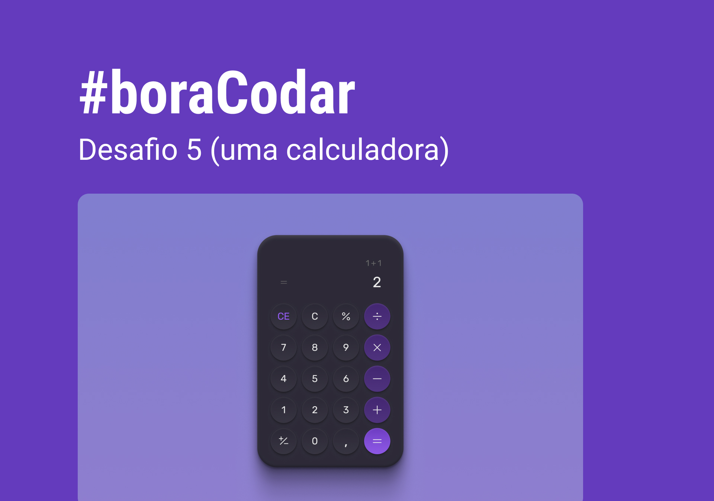

<h1 align="center">Calculadora<h1>

Projeto desenvolvido com os desafios #boracodar da Rocketseat.  

  <a href="#-tecnologias">Tecnologias</a>&nbsp;&nbsp;&nbsp;|&nbsp;&nbsp;&nbsp;
  <a href="#-projeto">Projeto</a>&nbsp;&nbsp;&nbsp;|&nbsp;&nbsp;&nbsp;
  <a href="#-layout">Layout</a>&nbsp;&nbsp;&nbsp;

  

## 🚀 Tecnologias 

- HTML 
- CSS
- Git e Github
- Figma

## 👨‍💻 Projeto 

[📌 Clique aqui para acessar](https://murilopizolito.github.io/Bora-codar-desafios/Calculadora/)

## 🔖 Layout

Você pode visualizar o layout do projeto através [DESSE LINK](https://www.figma.com/community/file/1202607074523509182). É necessário ter conta no [Figma](https://figma.com) para acessá-lo.

